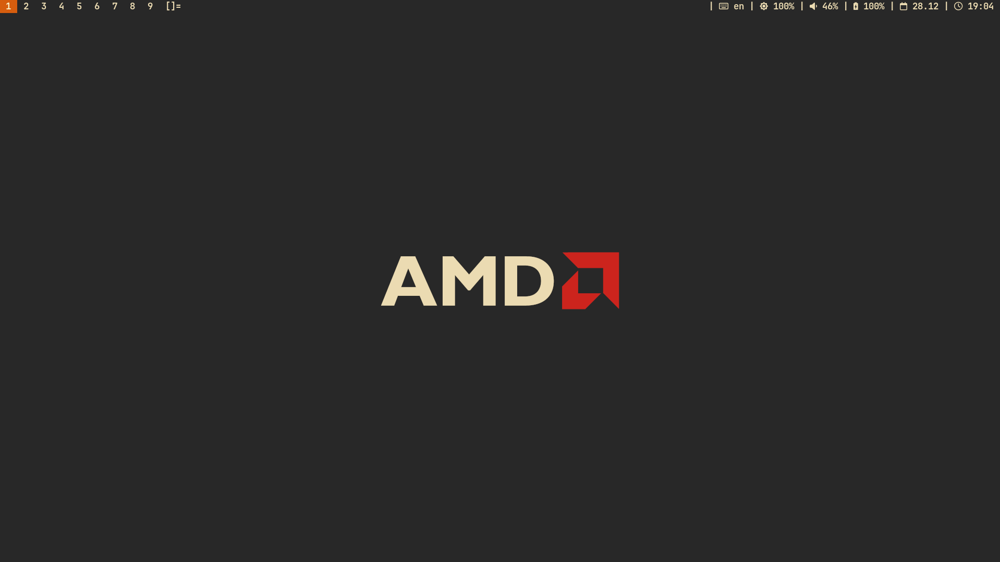
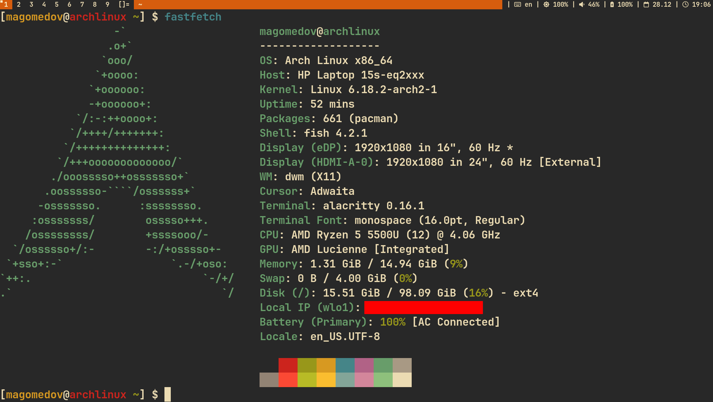

# dwm

Минималистичная сборка **dwm + dwmblocks** под Arch Linux для работы/программирования: быстрый X11-тайлинг, лёгкие утилиты, аккуратные скрипты для статусбара (батарея/яркость/громкость/раскладка/капс/время/CPU/RAM), набор CLI-инструментов и базовый софт для повседневной работы.

## Скриншоты



## Что внутри

- Window manager: `dwm`
- Bar: `dwmblocks`
- Launcher: `dmenu`
- Terminal: `alacritty`
- Shell: `fish`
- Notifications: `dunst`
- Wallpapers: `feh` (папка `Wallpapers`)
- Screenshot: `flameshot`
- Media: `mpv`, `playerctl`
- PDF: `zathura`
- Power / battery: `tlp`, `auto-cpufreq`, `upower`
- Audio: `pamixer`
- Brightness: `brightnessctl`

## Требования

- Arch Linux (или совместимый, но команды ниже — под `pacman`)
- X11 (Xorg)
- GPU: AMD (в инструкции — `xf86-video-amdgpu`, `mesa`, `vulkan-radeon`)
- systemd

## Установка (полная)

### 1) Обновление системы

```bash
sudo pacman -Syu
```

### 2) Установка X11

```bash
sudo pacman -S xorg-server xorg-xrandr xorg-xinit xorg-xset
```

### 3) Драйверы (AMD)

```bash
sudo pacman -S mesa libva-mesa-driver vulkan-radeon xf86-video-amdgpu
```

### 4) Шрифты

```bash
sudo pacman -S nerd-fonts ttf-jetbrains-mono ttf-fira-code noto-fonts ttf-dejavu noto-fonts-emoji ttf-font-awesome ttf-hack otf-font-awesome
```

### 5) Программы (pacman)

```bash
sudo pacman -S dmenu fish alacritty neovim git tmux wget github-cli curl openssh less upower
sudo pacman -S htop btop fastfetch brightnessctl tlp reshift pamixer xdg-user-dirs
sudo pacman -S ranger ripgrep fd fzf tree lsd bat unzip zip unrar
sudo pacman -S feh flameshot mpv playerctl zathura
sudo pacman -S firefox obsidian telegram-desktop
sudo pacman -S uv zed docker lazygit
```

### 6) Создание стандартных директорий

```bash
xdg-user-dirs-update
```

### 7) Установка yay (AUR helper)

```bash
cd ~/Downloads
git clone https://aur.archlinux.org/yay
cd yay
makepkg -si
cd ..
rm -rf yay
```

### 8) Программы через AUR

```bash
yay -S auto-cpufreq nekoray-bin amneziavpn-bin
```

### 9) Установка этой сборки

```bash
git clone https://github.com/akhmedovh4mid/dwm.git
```

# обои

```bash
cp -r Wallpapers ~/Pictures
```

# конфиги

```bash
cp -r alacritty ~/.config
cp -r dwm ~/.config
cp -r dwmblocks ~/.config
cp -r fish ~/.config
cp -r scripts ~/.config
```

# touchpad config

```bash
sudo cp 30-touchpad.conf /etc/X11/xorg.conf.d
```

# стартовый скрипт dwm

```bash
sudo cp startdwm.sh /usr/local/bin
```

### 10) Сборка и установка dwm

```bash
cd ~/.config/dwm
make && sudo make clean install
```

### 11) Сборка и установка dwmblocks

```bash
cd ~/.config/dwmblocks
make && sudo make clean install
```

### 12) Энергосбережение (systemd)

```bash
sudo systemctl enable --now tlp
sudo systemctl enable --now auto-cpufreq
```

### 13) Запуск через startx

```bash
echo "exec /usr/local/bin/startdwm.sh" > ~/.xinitrc
```

Теперь можно запускать X-сессию:
```bash
startx
```

## (Опционально) Neovim: LazyVim starter

```bash
sudo pacman -S tree-sitter-cli
git clone https://github.com/LazyVim/starter ~/.config/nvim
rm -rf ~/.config/nvim/.git
nvim
```

## Структура репозитория

Ожидаемая структура (как используется в инструкции):

- dwm/ — исходники/конфиг dwm (патчи, config.h или config.def.h)
- dwmblocks/ — исходники dwmblocks (blocks.h, скрипты/команды)
- alacritty/ — конфиг терминала
- fish/ — конфиг shell
- scripts/ — скрипты для dwmblocks (battery/brightness/volume/layout/caps/date/time/cpu/mem и т.д.)
- Wallpapers/ — обои
- startdwm.sh — скрипт запуска сессии
- 30-touchpad.conf — конфиг тачпада для Xorg

## dwmblocks: как подключаются скрипты

Скрипты должны:
- быть исполняемыми (chmod +x)
- печатать одну строку в stdout
- быстро отрабатывать (без тяжёлых операций)

Типичный формат вывода:
- <icon> <value> (Nerd Font icons)

Настройка происходит в dwmblocks/blocks.h: указываешь путь к скрипту и интервал обновления.

## Полезные замечания

### Docker
Чтобы запускать docker без root (опционально):

```bash
sudo systemctl enable --now docker
sudo usermod -aG docker "$USER"
```

После добавления в группу — перелогинься.

### VPN клиенты
- amneziavpn-bin ставится через AUR.
- nekoray-bin ставится через AUR.

## Troubleshooting

- Если dwm не стартует из startx:
  - проверь ~/.xinitrc
  - проверь, что /usr/local/bin/startdwm.sh существует и исполняемый
  - посмотри лог ~/.local/share/xorg/Xorg.0.log (или ~/.xsession-errors)

- Если не отображаются иконки:
  - убедись, что установлен Nerd Font и он выбран в терминале/баре

## License

MIT (или укажи свою, если другая).
